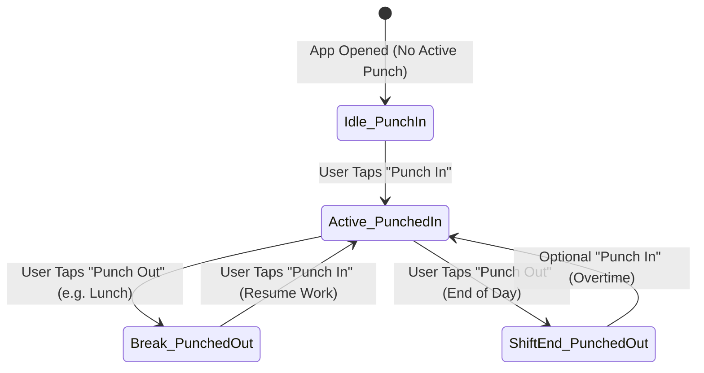

# Mobile App Integration Specification: Multiple Attendance & 45-Min Grace Timing

## 1. Overview for Mobile App Team

This specification outlines the UI/UX changes, state machine transitions, and API contracts required for the mobile application to support:

1. **Multiple Punch Sessions per Day**:
   - Employees can punch in and punch out multiple times a day (e.g., Morning In $\rightarrow$ Lunch Out $\rightarrow$ Post-Lunch In $\rightarrow$ Evening Out).
   - The screen **NO LONGER LOCKS** after the first punch-out.
2. **Dynamic Daily Attendance Status**:
   - Daily attendance status (`Absent`, `Half Day`, `Present`) is automatically computed in real-time based on cumulative net working hours (breaks excluded).
3. **Monthly 45-Minute Grace Tracker**:
   - Displays real-time monthly late entry grace (45 mins) and early exit grace (45 mins) balance and penalty warnings.

---

## 2. Core UI/UX Screen Changes

### 2.1 Punch Button & State Machine (Main Screen)



#### Comparison: Old vs. New Behavior

| State | Old App Behavior | New App Behavior |
| :--- | :--- | :--- |
| **Morning (Before Punch In)** | Green "Punch In" Button | Green "Punch In" Button (`show_label = 'Punch_in'`) |
| **During Work Session** | Red "Punch Out" Button | Red "Punch Out" Button (`show_label = 'Punch_out'`) |
| **After Punch Out (e.g. Lunch)** | **LOCKED!** Button disabled, label: *"Attendance Registered"* | **UNLOCKED!** Button turns back to **"Punch In"** (`show_label = 'Punch_in'`) |
| **Post-Lunch Resume** | Not allowed | User taps **"Punch In"** to begin Session 2 |
| **Evening Shift End** | - | User taps **"Punch Out"** to end Session 2 |

> [!IMPORTANT]
> **Remove the hard-coded lock condition!** Previously, if `out_time` was not empty, the mobile app disabled the punch button with `Attendance_register`. In the new architecture, always follow the `show_label` property from `checkAttendance`:
> - If `show_label === 'Punch_out'` $\rightarrow$ Show **Punch Out** button.
> - If `show_label === 'Punch_in'` $\rightarrow$ Show **Punch In** button.

---

### 2.2 Today's Working Hours & Punch Sessions Timeline (Today Card)

Instead of just showing 1 static In Time and 1 Out Time, display the **Net Work Duration** and the **Punch Sessions Timeline**:

```
┌─────────────────────────────────────────────────────────┐
│  TODAY'S ATTENDANCE                                     │
│  Date: 19 Sep 2026 (Saturday)                           │
│                                                         │
│  Status: [ PRESENT (1.0 Day) ]                          │
│                                                         │
│  ⏱️ Net Working Time:  08h 30m    ☕ Total Break: 00h 45m│
│                                                         │
│  ┌───────────────────────────────────────────────────┐  │
│  │ 🟢 Session 1: 09:30 AM - 01:15 PM      (03h 45m)  │  │
│  │    ☕ Break: 01:15 PM - 02:00 PM       (00h 45m)  │  │
│  │ 🟢 Session 2: 02:00 PM - 07:05 PM      (05h 05m)  │  │
│  └───────────────────────────────────────────────────┘  │
│                                                         │
│  [             🔴 PUNCH OUT FOR BREAK / DAY END       ]  │
└─────────────────────────────────────────────────────────┘
```

#### Field Bindings:
- **Net Work Duration**: Use `data.total_work_formatted` (e.g., `"08h 30m"`).
- **Total Break Duration**: Use `data.total_break_formatted` (e.g., `"00h 45m"`).
- **Punch Sessions**: Iterate over `data.punches` array.

---

### 2.3 Dynamic Daily Status Badge & Rules

The status badge dynamically updates according to accumulated net working minutes:

| Total Work Duration | Attendance Status | Payroll Credit | Color Badge | Description |
| :--- | :--- | :--- | :--- | :--- |
| **$< 3\text{ Hours}$ ($< 180\text{ mins}$)** | **`Absent`** | $0.0\text{ Paid Day}$ | 🔴 Gray / Red | Net duration is insufficient for attendance. |
| **$3\text{ to }5\text{ Hours}$ ($180\text{ to }300\text{ mins}$)** | **`Half Day`** | $0.5\text{ Paid Day}$ | 🟡 Amber / Orange | Partial day credited. |
| **$> 5\text{ Hours}$ ($> 300\text{ mins}$)** | **`Present`** | $1.0\text{ Paid Day}$ | 🟢 Green | Full working day credited. |

> [!NOTE]
> **Lunch Transition**: When an employee punches out for lunch having worked 3.5 hours, the status badge will display **`Half Day`**. When they punch back in after lunch and complete the day (e.g., reaching 8.5 total hours), upon the evening punch-out the status badge automatically upgrades to **`Present`**!

---

### 2.4 Monthly 45-Minute Grace Period Tracker Widget

Display a monthly grace tracker on the employee home dashboard or attendance summary screen:

```
┌─────────────────────────────────────────────────────────┐
│  MONTHLY GRACE BALANCE (September 2026)                 │
│                                                         │
│  ⏰ Late Entry Grace:                                   │
│     Used: 15 mins / 45 mins    [ 30 mins remaining ]    │
│     [████████░░░░░░░░░░░░░░░░░░░░░░░]                   │
│                                                         │
│  🚪 Early Exit Grace:                                   │
│     Used: 0 mins / 45 mins     [ 45 mins remaining ]    │
│     [░░░░░░░░░░░░░░░░░░░░░░░░░░░░░░░]                   │
│                                                         │
│  ⚠️ Rule: Excess minutes beyond 45 mins are deducted    │
│     hourly from earned gross salary.                    │
└─────────────────────────────────────────────────────────┘
```

#### Alert Banner when Grace is Exceeded:
If `late_excess_minutes > 0` or `early_excess_minutes > 0`:
> ⚠️ **Notice**: You have exceeded monthly grace by **{late_excess_minutes + early_excess_minutes} minutes**. An hourly salary rate deduction will be applied in this month's payroll.

---

## 3. Complete API Specifications

All endpoints use Sanctum Bearer Token: `Authorization: Bearer <token>`.

### 3.1 `POST /api/check-attendance`

Determines the current punch state, today's sessions, and monthly grace statistics.

#### Request:
```json
{
  "date": "2026-09-19" // Optional, defaults to today
}
```

#### Response (`200 OK`):
```json
{
  "success": true,
  "data": {
    "show_label": "Punch_in", // "Punch_in" OR "Punch_out"
    "in_time": "09:30:00", // First punch in of today (HH:mm:ss)
    "out_time": "19:05:00", // Latest punch out of today (HH:mm:ss)
    "today_attendance_status": "Present", // "Present" | "Half Day" | "Absent" | "Leave"
    "raw_status": "Present",
    "total_work_minutes": 510,
    "total_work_formatted": "08h 30m",
    "total_break_minutes": 45,
    "total_break_formatted": "00h 45m",
    "punches": [
      {
        "id": 101,
        "punch_in": "09:30:00",
        "punch_out": "13:15:00",
        "duration_minutes": 225,
        "duration_formatted": "03h 45m",
        "punch_type": "regular",
        "is_active": false
      },
      {
        "id": 102,
        "punch_in": "14:00:00",
        "punch_out": "19:05:00",
        "duration_minutes": 305,
        "duration_formatted": "05h 05m",
        "punch_type": "regular",
        "is_active": false
      }
    ],
    "grace_info": {
      "late_grace_allowed": 45,
      "late_used_minutes": 15,
      "late_remaining_minutes": 30,
      "late_excess_minutes": 0,
      "early_grace_allowed": 45,
      "early_used_minutes": 0,
      "early_remaining_minutes": 45,
      "early_excess_minutes": 0
    }
  },
  "message": "data found!!"
}
```

---

### 3.2 `POST /api/add-in-time` (Punch In)

Initiates a punch session. On the first punch of the day, it registers attendance master. Subsequent punches calculate breaks.

#### Request (Multipart / Form-Data):
| Field | Type | Required | Description |
| :--- | :--- | :--- | :--- |
| `date` | `string (YYYY-MM-DD)` | Yes | Attendance date |
| `in_time` | `string (HH:mm:ss)` | Yes | Time of punch in |
| `in_location` | `string` | No | Geocoded reverse address |
| `in_lat` | `float / double` | Yes | Latitude |
| `in_long` | `float / double` | Yes | Longitude |
| `in_image` | `file (image)` | Yes | Front selfie photo |
| `in_video` | `file (video)` | No | Optional video |
| `punch_type` | `string` | No | `'regular'`, `'lunch'`, `'break'`, `'visit'` (Default: `'regular'`) |

#### Success Response (`200 OK`):
```json
{
  "success": true,
  "data": {
    "attendance_id": 450,
    "punch_id": 103
  },
  "message": "Welcome to office !!"
}
```

#### Error Response (If already punched in without punching out):
```json
{
  "success": false,
  "message": "You are already Punch IN !!",
  "data": {
    "error": "You are already Punch IN !!"
  }
}
```

---

### 3.3 `POST /api/add-out-time` (Punch Out)

Closes the active open session, recalculates total work minutes, break minutes, early exit, extra time, and auto-updates the status.

#### Request (Multipart / Form-Data):
| Field | Type | Required | Description |
| :--- | :--- | :--- | :--- |
| `date` | `string (YYYY-MM-DD)` | Yes | Attendance date |
| `out_time` | `string (HH:mm:ss)` | Yes | Time of punch out |
| `out_location` | `string` | No | Geocoded reverse address |
| `out_lat` | `float / double` | Yes | Latitude |
| `out_long` | `float / double` | Yes | Longitude |
| `out_image` | `file (image)` | Yes | Front selfie photo |
| `out_video` | `file (video)` | No | Optional video |

#### Success Response (`200 OK`):
```json
{
  "success": true,
  "data": {
    "total_work_minutes": 510,
    "total_work_formatted": "08h 30m",
    "status": "Present" // Automatically updated based on work minutes
  },
  "message": "See you soon, Take care !!!"
}
```

#### Error Response (If no active punch session is found):
```json
{
  "success": false,
  "message": "Attendance record not found or already punched out!!",
  "data": {
    "error": "No active punch in found!"
  }
}
```

---

### 3.4 `POST /api/attendance-status-count`

Returns monthly summary counters including the new Grace Period details.

#### Request:
```json
{
  "year": 2026,
  "month": 9,
  "current_date": "2026-09-19"
}
```

#### Response (`200 OK`):
```json
{
  "success": true,
  "data": {
    "total_present": 18,
    "total_absent": 1,
    "total_halfday": 0,
    "total_paidleave": 1,
    "total_notmarked": 0,
    "total_late_time_in_min": 55,
    "total_early_exit_in_min": 10,
    "total_extra_time_in_min": 35,
    
    "late_grace_allowed": 45,
    "late_grace_remaining": 0,
    "late_grace_excess": 10,
    
    "early_grace_allowed": 45,
    "early_grace_remaining": 35,
    "early_grace_excess": 0
  },
  "message": "Data found!"
}
```

---

### 3.5 `POST /api/attendance-by-user`

Returns user attendance calendar logs with embedded `punches` array for full session inspection.

#### Request:
```json
{
  "year": 2026,
  "month": 9
}
```

#### Response item snippet:
```json
{
  "id": 450,
  "employee_id": 12,
  "date": "2026-09-19",
  "status": "Present",
  "in_time": "2026-09-19 09:30:00",
  "out_time": "2026-09-19 19:05:00",
  "total_work_minutes": 510,
  "total_break_minutes": 45,
  "punches": [
    {
      "id": 101,
      "punch_in": "2026-09-19 09:30:00",
      "punch_out": "2026-09-19 13:15:00",
      "duration_minutes": 225,
      "punch_type": "regular"
    },
    {
      "id": 102,
      "punch_in": "2026-09-19 14:00:00",
      "punch_out": "2026-09-19 19:05:00",
      "duration_minutes": 305,
      "punch_type": "regular"
    }
  ]
}
```

---

## 4. Mobile Implementation Checklist

- [ ] **Remove Button Lock**: Ensure the screen never disables the punch button permanently upon punch-out. Rely solely on `show_label` (`'Punch_in'` vs `'Punch_out'`).
- [ ] **Punch In Flow**:
  - Send selfie, GPS coords, date, current time to `/api/add-in-time`.
  - On success, refresh attendance state via `/api/check-attendance`.
- [ ] **Punch Out Flow**:
  - Send selfie, GPS coords, date, current time to `/api/add-out-time`.
  - On success, toast confirmation and refresh attendance state via `/api/check-attendance`. Button should immediately switch to "Punch In".
- [ ] **Total Work & Break Counter**:
  - Render `total_work_formatted` and `total_break_formatted`.
- [ ] **Dynamic Status Badge**:
  - Display badge using `today_attendance_status` with dynamic colors (Green for Present, Yellow for Half Day, Red for Absent).
- [ ] **Punch Sessions Timeline Card**:
  - Render list of daily punch intervals from `punches` array.
- [ ] **Monthly Grace Tracker Widget**:
  - Render progress bars for `late_used_minutes` / `late_grace_allowed` and `early_used_minutes` / `early_grace_allowed`.
  - Display warning if `late_excess_minutes > 0` or `early_excess_minutes > 0`.
